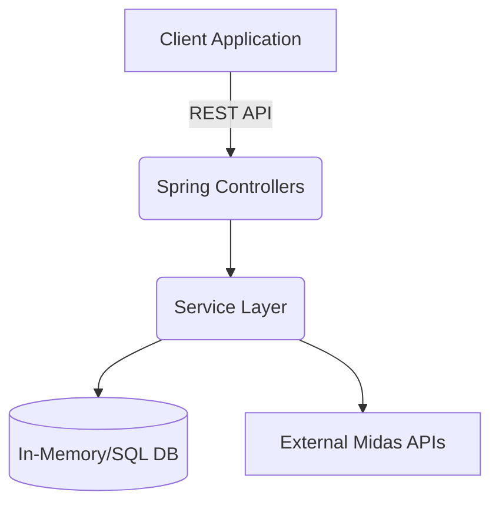

# 🏦 Forage Midas

A Java Spring Boot backend service designed for high-performance financial data processing and banking simulations.

## 🏗 Architecture & Stack
This repository follows standard Java enterprise architectural patterns (MVC/Service layer).
- **Core Framework**: Spring Boot (configured via `application.yml`).
- **Build System**: Maven Wrapper (`mvnw`), ensuring reproducible builds without requiring a local Maven installation.
- **Project Structure**: Source code resides in `src/`, with core logic implemented in the `services/` directory.



## 🛠 Local Execution
Since the repository includes the Maven Wrapper, setup is zero-configuration if Java is installed.

1. **Verify Java Version**: Ensure JDK 11+ is installed.
2. **Build the Project**:
   ```bash
   ./mvnw clean install
   ```
3. **Run the Application**:
   ```bash
   ./mvnw spring-boot:run
   ```
